# Network Map — Homeops

```mermaid
graph TB
    %% ════════════════════════════════════════
    %% Internet & Edge
    %% ════════════════════════════════════════
    Internet((🌐 Internet<br/>1000/1000 Fiber))

    %% ════════════════════════════════════════
    %% Network Equipment
    %% ════════════════════════════════════════
    subgraph garage_rack["🔧 Garage Rack"]
        direction TB
        UDM["Unifi Dream Machine<br/>Pro Max<br/><i>Router / Firewall</i>"]
        UPS_GARAGE["Eaton 9130 3000VA-R"]
        USW_GARAGE["USW Pro Max 16 PoE"]

        subgraph nuc["Intel NUC · N6005 · 24GB RAM"]
            direction LR
            NUC_LXC_100["LXC 100<br/>ns2 · Technitium DNS"]
            NUC_LXC_106["LXC 106<br/>z2m · Zigbee2MQTT"]
            NUC_LXC_108["LXC 108<br/>esphome"]
            NUC_LXC_110["LXC 110<br/>tdarr"]
            NUC_LXC_111["LXC 111<br/>plex"]
            NUC_LXC_112["LXC 112<br/>myspeed"]
            NUC_VM_103["VM 103<br/>talos2 ⚙️ CP"]
        end

        subgraph meanie["HP DL360 Gen9 · Meanie · Proxmox"]
            direction LR
            M_LXC_102["LXC 102<br/>mariadb"]
            M_LXC_104["LXC 104<br/>bambuddy"]
            M_LXC_105["LXC 105<br/>emqx"]
            M_LXC_107["LXC 107<br/>nodered"]
            M_LXC_109["LXC 109<br/>hass · Home Assistant"]
            M_LXC_113["LXC 113<br/>npmplus"]
            M_LXC_115["LXC 115<br/>vaultwarden"]
            M_LXC_116["LXC 116<br/>peanut · NUT"]
            M_LXC_117["LXC 117<br/>sabnzbd2"]
            M_VM_120["VM 120<br/>talos1 ⚙️ CP"]
            M_VM_122["VM 122<br/>talos4 👷 Worker"]
            M_VM_123["VM 123<br/>talos5 👷 Worker"]
            M_STORAGE["ZFS pool: tank<br/>8× Samsung PM883"]
        end

        subgraph truenas["HP DL380 Gen9 · TrueNAS"]
            direction LR
            subgraph truenas_vms["Virtual Machines"]
                T_VM_PQD["ProxmoxQuorum<br/>Quorum Device"]
                T_VM_PBS["PBS<br/>Proxmox Backup Server"]
                T_VM_T3["talos3 ⚙️ CP"]
                T_VM_T6["talos6 👷 Worker"]
                T_VM_T7["talos7 👷 Worker"]
            end
            subgraph truenas_apps["TrueNAS Apps"]
                T_APP_COLLABORA["Collabora"]
                T_APP_IMMICH["Immich"]
                T_APP_MINIO["MinIO"]
                T_APP_NEXTCLOUD["Nextcloud"]
                T_APP_STORJ["Storj"]
            end
            subgraph truenas_storage["Storage · Pool: Nakkiallas"]
                RAIDZ1_1["RAIDZ1<br/>4× ST18000NM003D<br/>18TB Seagate Exos"]
                RAIDZ1_2["RAIDZ1<br/>4× ST8000VN0022<br/>8TB Seagate IronWolf"]
                NVME["Samsung 970 EVO Plus<br/>250GB · Boot"]
            end
        end
    end

    subgraph house_rack["🏠 House Rack"]
        direction TB
        PATCH["Keystone Patch Panel<br/>14× RJ45 wall sockets"]
        USW_HOUSE["USW Enterprise 24 PoE"]
        FRITZ["Fritz!Box<br/>DVB-C Tuner for Plex"]
        UPS_HOUSE["BackUPS Pro 650"]
    end

    subgraph house_network["🏠 House Network"]
        direction TB
        subgraph desk_area["🖥️ Desk"]
            USW_FLEX_XG["USW Flex XG<br/>2.5GbE"]
            PC["PC · Workstation"]
            WORK_LAPTOP["Work Laptop"]
            RPI_NUT["Raspberry Pi 3<br/>NUT Server"]
            UPS_DESK["Eaton Ellipse 1600"]
        end
        subgraph front_yard["Front Yard"]
            USW_FLEX["USW Flex"]
            UAP_AC_PRO["UAP-AC-Pro<br/>Outdoor AP"]
            CAM_G4PRO_FRONT["G4 Pro Camera<br/>Front Yard"]
            SMART_FLOOD["Smart Flood Light"]
        end
        subgraph entryway["Entryway"]
            U6_ENTRY["U6-Lite AP"]
            CAM_DOORBELL["G4 Doorbell<br/>Front Door"]
            CAM_KIDS["G4 Instant<br/>Kids Room"]
        end
        subgraph office["Office"]
            U6_OFFICE["U6-Lite AP"]
            CAM_OFFICE["G4 Instant<br/>Office"]
        end
        subgraph living_room["Living Room"]
            U7_LIVING["U7-Pro AP"]
        end
    end

    subgraph garage_wifi["🔧 Garage WiFi & Cameras"]
        AI_PORT["Unifi AI Port<br/>AI Detections"]
        U6_GARAGE["U6-Lite AP<br/>Garage"]
        CAM_GARAGE["G4 Instant<br/>Garage"]
        CAM_STORAGE["G4 Instant<br/>Storage"]
    end

    %% ════════════════════════════════════════
    %% Kubernetes Cluster (across Talos nodes)
    %% ════════════════════════════════════════
    subgraph k8s["☸ Kubernetes Cluster · 7 Talos Nodes"]
        direction TB
        subgraph k8s_cp["Control Plane"]
            CP1["talos1<br/>meanie"]
            CP2["talos2<br/>NUC"]
            CP3["talos3<br/>TrueNAS"]
        end
        subgraph k8s_workers["Workers"]
            W4["talos4<br/>meanie"]
            W5["talos5<br/>meanie"]
            W6["talos6<br/>TrueNAS"]
            W7["talos7<br/>TrueNAS"]
        end
        subgraph k8s_infra["Infrastructure"]
            K_CILIUM["Cilium · CNI + BGP"]
            K_COREDNS["CoreDNS"]
            K_FLUX["Flux · GitOps"]
            K_CERTSM["cert-manager"]
            K_EXTSEC["External Secrets<br/>Bitwarden ESO"]
            K_KYVERNO["Kyverno"]
            K_METRICS["Metrics Server"]
            K_RELOADER["Reloader"]
            K_DESCHEDULER["Descheduler"]
            K_MULTUS["Multus"]
            K_SNAPSHOT["Snapshot Controller"]
        end
        subgraph k8s_network["Network"]
            K_TRAEFIK["Traefik"]
            K_CF_TUNNEL["Cloudflare Tunnel"]
            K_CF_DNS["Cloudflare DNS"]
            K_INT_DNS["Internal DNS"]
            K_CLUSTER_DNS["Cluster DNS"]
            K_GATEWAYS["Gateway API"]
            K_TECHNITIUM["Technitium"]
        end
        subgraph k8s_media["Media"]
            K_SONARR["Sonarr"]
            K_RADARR["Radarr"]
            K_PROWLARR["Prowlarr"]
            K_BAZARR["Bazarr"]
            K_READARR["Readarr"]
            K_SABNZBD["Sabnzbd"]
            K_TAUTULLI["Tautulli"]
            K_MAINTAINERR["Maintainerr"]
            K_WIZARR["Wizarr"]
            K_CONFIGARR["Configarr"]
            K_SPOTARR["Spotarr"]
            K_TAGGARR["Taggarr"]
        end
        subgraph k8s_observability["Observability"]
            K_PROM["Kube Prometheus Stack"]
            K_GRAFANA["Grafana"]
            K_LOKI["Loki"]
            K_ALLOY["Alloy"]
            K_GATUS["Gatus"]
            K_GOLDILOCKS["Goldilocks"]
            K_KROMGO["Kromgo"]
            K_ROBUSTA["Robusta"]
            K_SYSLOG["Syslog Gateway"]
            K_UNPOLLER["Unpoller"]
            K_VPA["VPA"]
        end
        subgraph k8s_storage["Storage"]
            K_HARBOR["Harbor"]
            K_KOPIA["Kopia"]
            K_VOLSYNC["VolSync"]
            K_LPP["Local Path Provisioner"]
        end
        subgraph k8s_database["Database"]
            K_CNPG["CloudNative-PG"]
            K_DRAGONFLY["Dragonfly"]
        end
        subgraph k8s_apps["Applications"]
            K_AUTHENTIK["Authentik · SSO"]
            K_HOMEPAGE["Homepage"]
            K_ECHO["Echo"]
            K_ATUIN["Atuin"]
            K_AUDIOBOOKSHELF["Audiobookshelf"]
            K_N8N["n8n"]
            K_HEADLAMP["Headlamp"]
            K_BAMBUDDY_K["Bambuddy"]
            K_GPRO["gpro"]
            K_LOG_AGG["Log Aggregator"]
        end
    end

    %% ════════════════════════════════════════
    %% Connections
    %% ════════════════════════════════════════
    Internet -->|Fiber| UDM
    UDM --- USW_GARAGE
    USW_GARAGE ===|"10GbE Fiber"| USW_HOUSE
    USW_HOUSE --- PATCH
    USW_HOUSE --- FRITZ

    %% House patch panel connections
    PATCH --- USW_FLEX_XG
    PATCH --- USW_FLEX
    PATCH --- U6_ENTRY
    PATCH --- U6_OFFICE
    PATCH --- U7_LIVING

    %% Desk area
    USW_FLEX_XG ---|2.5GbE| PC
    USW_FLEX_XG ---|2.5GbE| WORK_LAPTOP
    USW_FLEX_XG --- RPI_NUT
    RPI_NUT -.-|USB| UPS_DESK
    UPS_DESK -.-|Powers| PC
    UPS_DESK -.-|Powers| WORK_LAPTOP

    %% Front yard
    USW_FLEX ---|PoE| UAP_AC_PRO
    USW_FLEX ---|PoE| CAM_G4PRO_FRONT
    USW_FLEX ---|PoE| SMART_FLOOD

    %% Entryway
    U6_ENTRY -.- CAM_DOORBELL
    U6_ENTRY -.- CAM_KIDS

    %% Office
    U6_OFFICE -.- CAM_OFFICE

    %% Garage WiFi & Cameras
    USW_GARAGE ---|PoE| AI_PORT
    USW_GARAGE ---|PoE| U6_GARAGE
    U6_GARAGE -.- CAM_GARAGE
    U6_GARAGE -.- CAM_STORAGE
    AI_PORT -.->|AI Detection| CAM_DOORBELL
    AI_PORT -.->|AI Detection| CAM_G4PRO_FRONT
    AI_PORT -.->|AI Detection| CAM_GARAGE

    %% Servers
    USW_GARAGE --- nuc
    USW_GARAGE --- meanie
    USW_GARAGE --- truenas

    UPS_GARAGE -.-|Powers| nuc
    UPS_GARAGE -.-|Powers| meanie
    UPS_GARAGE -.-|Powers| truenas
    UPS_HOUSE -.-|Powers| USW_HOUSE

    %% Talos node mapping
    M_VM_120 -.-> CP1
    NUC_VM_103 -.-> CP2
    T_VM_T3 -.-> CP3
    M_VM_122 -.-> W4
    M_VM_123 -.-> W5
    T_VM_T6 -.-> W6
    T_VM_T7 -.-> W7

    %% ════════════════════════════════════════
    %% Styling
    %% ════════════════════════════════════════
    classDef cp fill:#1a5276,stroke:#2980b9,color:#fff
    classDef worker fill:#1e8449,stroke:#27ae60,color:#fff
    classDef ups fill:#7d3c98,stroke:#9b59b6,color:#fff
    classDef network fill:#2c3e50,stroke:#34495e,color:#fff
    classDef storage fill:#b7950b,stroke:#f1c40f,color:#000
    classDef camera fill:#922b21,stroke:#e74c3c,color:#fff
    classDef wifi fill:#1a5276,stroke:#3498db,color:#fff

    class CP1,CP2,CP3 cp
    class W4,W5,W6,W7 worker
    class UPS_GARAGE,UPS_HOUSE,UPS_DESK ups
    class UDM,USW_GARAGE,USW_HOUSE,USW_FLEX_XG,USW_FLEX network
    class RAIDZ1_1,RAIDZ1_2,NVME storage
    class CAM_DOORBELL,CAM_KIDS,CAM_OFFICE,CAM_G4PRO_FRONT,CAM_GARAGE,CAM_STORAGE,AI_PORT camera
    class UAP_AC_PRO,U6_ENTRY,U6_OFFICE,U7_LIVING,U6_GARAGE wifi
```

## Legend

| Symbol | Meaning |
|---|---|
| ⚙️ CP | Kubernetes control plane node |
| 👷 Worker | Kubernetes worker node |
| ═══ | 10GbE fiber uplink |
| ─── | Ethernet |
| -·-·- | Power / logical mapping |

## Physical Hosts Summary

| Host | Hardware | Role | Talos Nodes | Storage |
|---|---|---|---|---|
| NUC "proxmox" | Intel N6005 · 24GB RAM | Proxmox | talos2 (CP) | Local |
| DL360 "meanie" | HP ProLiant Gen9 | Proxmox | talos1 (CP), talos4, talos5 | ZFS pool "tank" · 8× Samsung PM883 |
| DL380 "TrueNAS" | HP ProLiant Gen9 | TrueNAS | talos3 (CP), talos6, talos7 | 4×18TB + 4×8TB RAIDZ1 + 970 EVO boot |

## UPS Coverage

| UPS | Location | Protects |
|---|---|---|
| Eaton 9130 3000VA-R | Garage rack | NUC, DL360, DL380 |
| BackUPS Pro 650 | House rack | USW Enterprise 24 PoE, Fritz!Box |
| Eaton Ellipse 1600 | Desk (via RPi 3 NUT) | Workstation, monitors, peripherals |

## WiFi & Cameras

| Device | Location | Connection |
|---|---|---|
| UAP-AC-Pro | Front yard (outdoor) | USW Flex PoE |
| U6-Lite | Entryway | Patch panel |
| U6-Lite | Office | Patch panel |
| U7-Pro | Living room | Patch panel |
| U6-Lite | Garage | USW Pro Max PoE |
| G4 Pro | Front yard | USW Flex PoE |
| G4 Doorbell | Front door | WiFi (U6-Lite Entryway) |
| G4 Instant | Kids room | WiFi (U6-Lite Entryway) |
| G4 Instant | Office | WiFi (U6-Lite Office) |
| G4 Instant | Garage | WiFi (U6-Lite Garage) |
| G4 Instant | Storage | WiFi (U6-Lite Garage) |
| Smart Flood Light | Front yard | USW Flex PoE |
| Unifi AI Port | Garage rack | USW Pro Max PoE |
